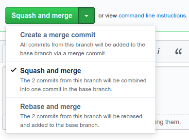
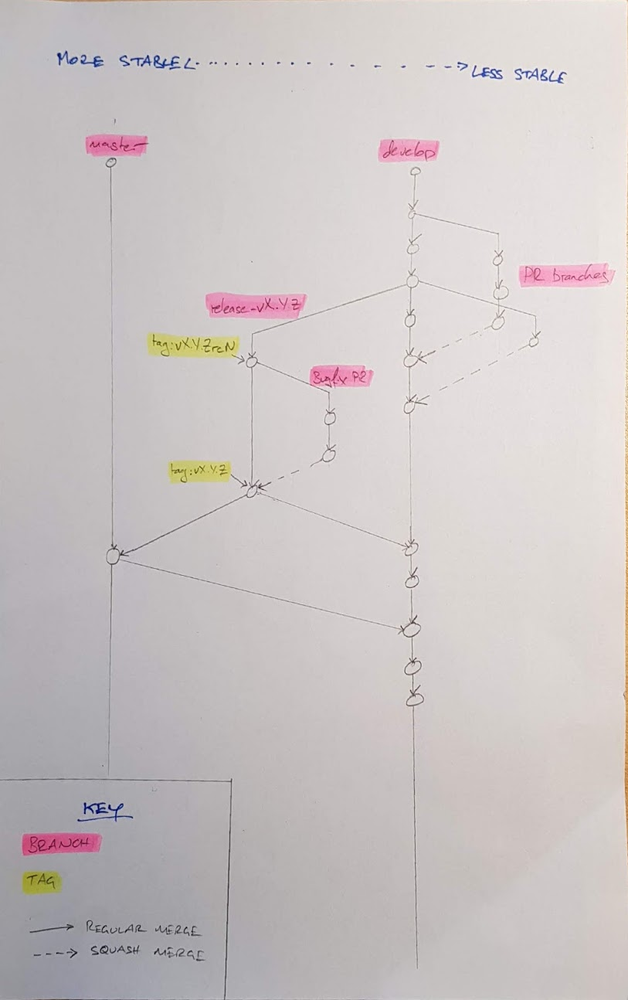

Some notes on how we use git
============================

On keeping the commit history clean
-----------------------------------

In an ideal world, our git commit history would be a linear progression of
commits each of which contains a single change building on what came
before. Here, by way of an arbitrary example, is the top of `git log --graph
b2dba0607`:

Note how the commit comment explains clearly what is changing and why. Also
note the *absence* of merge commits, as well as the absence of commits called
things like (to pick a few culprits):
[“pep8”](https://github.com/matrix-org/synapse/commit/84691da6c), [“fix broken
test”](https://github.com/matrix-org/synapse/commit/474810d9d),
[“oops”](https://github.com/matrix-org/synapse/commit/c9d72e457),
[“typo”](https://github.com/matrix-org/synapse/commit/836358823), or [“Who's
the president?”](https://github.com/matrix-org/synapse/commit/707374d5d).

There are a number of reasons why keeping a clean commit history is a good
thing:

 * From time to time, after a change lands, it turns out to be necessary to
   revert it, or to backport it to a release branch. Those operations are
   *much* easier when the change is contained in a single commit.

 * Similarly, it's much easier to answer questions like “is the fix for
   `/publicRooms` on the release branch?” if that change consists of a single
   commit.

 * Likewise: “what has changed on this branch in the last week?” is much
   clearer without merges and “pep8” commits everywhere.

 * Sometimes we need to figure out where a bug got introduced, or some
   behaviour changed. One way of doing that is with `git bisect`: pick an
   arbitrary commit between the known good point and the known bad point, and
   see how the code behaves. However, that strategy fails if the commit you
   chose is the middle of someone's epic branch in which they broke the world
   before putting it back together again.

One counterargument is that it is sometimes useful to see how a PR evolved as
it went through review cycles. This is true, but that information is always
available via the GitHub UI (or via the little-known [refs/pull
namespace](https://help.github.com/en/github/collaborating-with-issues-and-pull-requests/checking-out-pull-requests-locally)).

Of course, in reality, things are more complicated than that. We have release
branches as well as `develop` and `master`, and we deliberately merge changes
between them. Bugs often slip through and have to be fixed later. That's all
fine: this not a cast-iron rule which must be obeyed, but an ideal to aim
towards.

Merges, squashes, rebases: wtf?
-------------------------------

Ok, so that's what we'd like to achieve. How do we achieve it?

The TL;DR is: when you come to merge a pull request, you *probably* want to
“squash and merge”:

.

(This applies whether you are merging your own PR, or that of another
contributor.)

“Squash and merge”[1](#f1) takes all of the changes in the
PR, and bundles them into a single commit. GitHub gives you the opportunity to
edit the commit message before you confirm, and normally you should do so,
because the default will be useless (again: `* woops typo` is not a useful
thing to keep in the historical record).

The main problem with this approach comes when you have a series of pull
requests which build on top of one another: as soon as you squash-merge the
first PR, you'll end up with a stack of conflicts to resolve in all of the
others. In general, it's best to avoid this situation in the first place by
trying not to have multiple related PRs in flight at the same time. Still,
sometimes that's not possible and doing a regular merge is the lesser evil.

Another occasion in which a regular merge makes more sense is a PR where you've
deliberately created a series of commits each of which makes sense in its own
right. For example: [a PR which gradually propagates a refactoring operation
through the codebase](https://github.com/matrix-org/synapse/pull/6837), or [a
PR which is the culmination of several other
PRs](https://github.com/matrix-org/synapse/pull/5987). In this case the ability
to figure out when a particular change/bug was introduced could be very useful.

Ultimately: **this is not a hard-and-fast-rule**. If in doubt, ask yourself “do
each of the commits I am about to merge make sense in their own right”, but
remember that we're just doing our best to balance “keeping the commit history
clean” with other factors.

Git branching model
-------------------

A [lot](https://nvie.com/posts/a-successful-git-branching-model/)
[of](http://scottchacon.com/2011/08/31/github-flow.html)
[words](https://www.endoflineblog.com/gitflow-considered-harmful) have been
written in the past about git branching models (no really, [a
lot](https://martinfowler.com/articles/branching-patterns.html)). I tend to
think the whole thing is overblown. Fundamentally, it's not that
complicated. Here's how we do it.

Let's start with a picture:

It looks complicated, but it's really not. There's one basic rule: *anyone* is
free to merge from *any* more-stable branch to *any* less-stable branch at
*any* time[2](#f2). (The principle behind this is that if a
change is good enough for the more-stable branch, then it's also good enough go
put in a less-stable branch.)

Meanwhile, merging (or squashing, as per the above) from a less-stable to a
more-stable branch is a deliberate action in which you want to publish a change
or a set of changes to (some subset of) the world: for example, this happens
when a PR is landed, or as part of our release process.

So, what counts as a more- or less-stable branch? A little reflection will show
that our active branches are ordered thus, from more-stable to less-stable:

 * `master` (tracks our last release).
 * `release-vX.Y.Z` (the branch where we prepare the next release)[3](#f3).
 * PR branches which are targetting the release.
 * `develop` (our "mainline" branch containing our bleeding-edge).
 * regular PR branches.

The corollary is: if you have a bugfix that needs to land in both
`release-vX.Y.Z` *and* `develop`, then you should base your PR on
`release-vX.Y.Z`, get it merged there, and then merge from `release-vX.Y.Z` to
`develop`. (If a fix lands in `develop` and we later need it in a
release-branch, we can of course cherry-pick it, but landing it in the release
branch first helps reduce the chance of annoying conflicts.)

---

<b id="f1">[1]</b>: “Squash and merge” is GitHub's term for this
operation. Given that there is no merge involved, I'm not convinced it's the
most intuitive name. [^](#a1)

<b id="f2">[2]</b>: Well, anyone with commit access.[^](#a2)

<b id="f3">[3]</b>: Very, very occasionally (I think this has happened once in
the history of Synapse), we've had two releases in flight at once. Obviously,
`release-v1.2.3` is more-stable than `release-v1.3.0`. [^](#a3)
